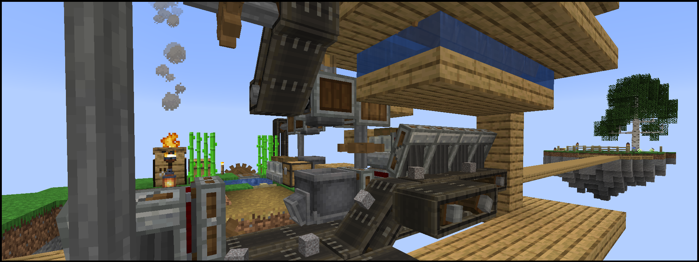

# Slime Skies – SkyBlock meets Create

.. is a SkyBlock style modpack for [Minecraft] 1.16.5 (Java Edition) which uses [Create] for a very uniquely different beginning in a void world. Start out with just a tree, a campfire, andesite, zinc and kelp. Explore 16 biome-themed islands to gain access to more plants and animals, as well as the Nether and End.



Be wary, this pack is still a **work in progress!** While it should be possible to build amazing mechanical- and redstone-powered automatons, there are some elements not yet finished: Not all islands have been built, you can't yet get to the End, and some items like diamonds and netherite are unobtainable.


## Download / Installation

The modpack is available as a **self-updating** [MultiMC] instance currently.

- Download and install [MultiMC] if you don't have it already.
- Drag the following link into the main window of MultiMC, and press "OK".  
  [`https://meowface.org/copygirl/Slime Skies.zip`](https://meowface.org/copygirl/Slime%20Skies.zip)  
  Alternatively, create a new instance, select "Import from zip" and enter the above URL.
- Start the game! At first launch, [packwiz] downloads all the config files and mods for you. When the modpack updates, the MultiMC instance will also update by itself with newly added / removed / updated mods, changed recipes, etc.

**IMPORTANT!** The actual SkyBlock map is contained within a `world_template` folder in the instance's Minecraft directory. You will have to copy this into your `saves` folder before you can play the map.

- In MultiMC, select the instance and click "Minecraft Folder" on the right.
- Copy the `world_template` folder, then go into your `saves` folder, paste the world, and optionally rename it. You can do this multiple times if you want to start over.
- Even `world_template` will automatically update with the modpack.

Unfortunately, there currently is no way to update a world you've already played with new or improved world content, such as new islands. (Unless you want to go through the effort of using a 3rd party map editor such as [Amulet] to copy them in.) You've been warned about the work-in-progress nature of this pack!

I wish this was simpler for you players, but I have not been able to find a mod for this version of Minecraft that automatically creates new worlds from a simple template. Sorry!


## Server Setup

We're using [packwiz] to for developing the modpack and providing the files files, such as mods, configs, the world map, ... So go ahead and grab the latest bootstrap `.jar` from its [GitHub Releases page][packwiz-releases], as well as [Forge for 1.16.5][forge-download] - the recommended version can be found in the [pack.toml](pack.toml).

```sh
# Adjust if necessary, such as if a new version is available / required.
wget https://github.com/comp500/packwiz-installer-bootstrap/releases/download/v0.0.3/packwiz-installer-bootstrap.jar
wget https://maven.minecraftforge.net/net/minecraftforge/forge/1.16.5-36.2.4/forge-1.16.5-36.2.4-installer.jar

# Download modpack files. Also run this to update.
java -jar packwiz-installer-bootstrap.jar -g -s server https://raw.githubusercontent.com/copygirl/slime-skies/main/pack.toml

# Download Minecraft and Forge files.
java -jar forge-1.16.5-36.2.4-installer.jar --installServer

# IMPORTANT! Before starting up the server, make sure
# copy the folder `world_template` and name it `world`.

# Now do the usual, accept the EULA, edit your server
# properties, run your startup script as you're used to.
java -jar -Xmx4G -Xms4G forge-1.16.5-36.2.4.jar nogui
```


## Development

Requires the [packwiz] tool, so be sure to download it first.

Steps to update the modpack:

- Run `packwiz update --all` to update all mods to latest.
- Run `packwiz refresh` to update file index, necessary when modifying any files.
- Now you can create a commit and push to the repo.

If you want to do local testing:

- Modify MultiMC instance's "pre-launch command" to use:  
  `http://localhost:8080/pack.toml`
- Run `packwiz serve` to run a simple webserver.  
  Will also update index automatically on file changes.
- Launch the instance and it will pull changes from your local setup.


[Minecraft]: https://minecraft.net/
[Create]: https://curseforge.com/minecraft/mc-mods/create
[MultiMC]: https://multimc.org/
[Amulet]: https://www.amuletmc.com/
[packwiz]: https://github.com/comp500/packwiz
[packwiz-releases]: https://github.com/comp500/packwiz-installer-bootstrap/releases
[forge-download]: https://files.minecraftforge.net/net/minecraftforge/forge/index_1.16.5.html
